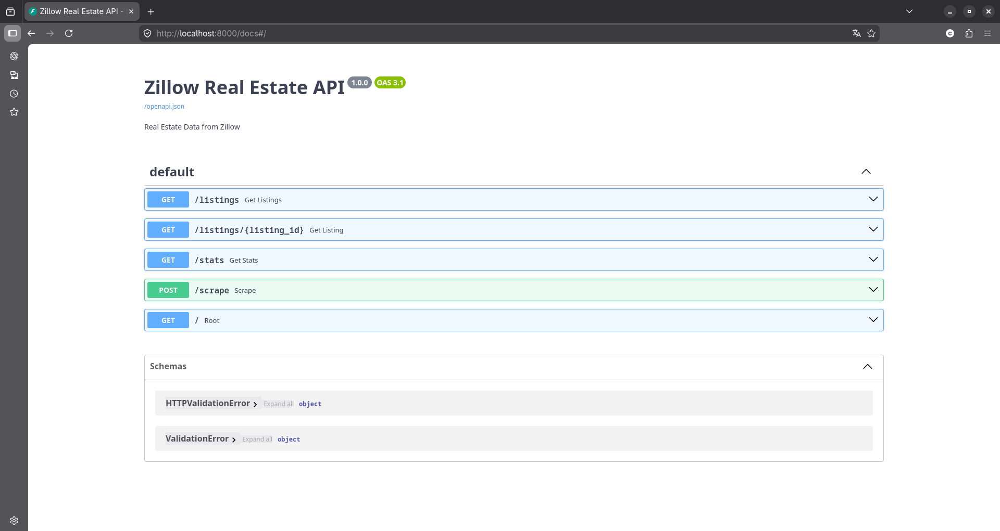
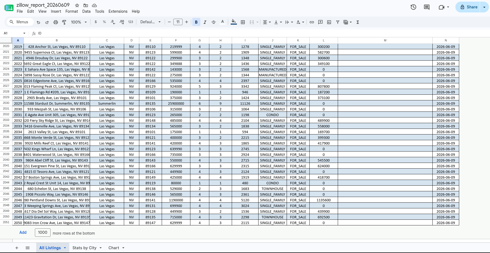

# Zillow Real Estate Data Pipeline

Collects real estate listings from the Zillow API across 10 major US cities,
stores them in PostgreSQL, serves them over a REST API, and generates
scheduled Excel reports.



## Features

- Fetches 2000+ listings via Zillow API
- Deduplicated by `zpid` on insert, so daily runs update existing listings
  instead of creating copies
- REST API with filters (city, price, bedrooms)
- Excel reports with charts
- Daily scheduler via APScheduler

## Tech Stack

- **Python 3.14**
- **FastAPI** — REST API
- **PostgreSQL + SQLAlchemy** — database
- **OpenPyXL** — Excel reports
- **APScheduler** — task automation
- **Zillow API** (OpenWebNinja)

## Data Collected

| Field | Description |
|-------|-------------|
| Address | Full property address |
| City / State | Location |
| Price | Listing price ($) |
| Bedrooms / Bathrooms | Room count |
| Living Area | Square footage |
| Home Type | CONDO, SINGLE_FAMILY, etc |
| Zestimate | Zillow price estimate |

## Cities Covered

New York, Los Angeles, Chicago, Houston, Phoenix,
Miami, Seattle, Denver, Austin, Las Vegas

## Installation

```bash
git clone https://github.com/VanguardXs/zillow-scraper.git
cd zillow-scraper
pip install -r requirements.txt
```

Create a `.env` file:

```
ZILLOW_API_KEY=your_api_key
DB_HOST=localhost
DB_PORT=5432
DB_NAME=zillow_db
DB_USER=zillow_user
DB_PASSWORD=yourpassword
```

## Usage

**Run scraper:**

```bash
python -c "from scraper.zillow_api import run_scraper; run_scraper()"
```

**Generate Excel report:**

```bash
python -c "from reports.excel_report import generate_report; generate_report()"
```

**Start API:**

```bash
uvicorn api.main:app --reload
```

**Start scheduler:**

```bash
python scheduler/tasks.py
```

## API Endpoints

| Method | Endpoint | Description |
|--------|----------|-------------|
| GET | `/listings` | All listings with filters |
| GET | `/listings/{id}` | Single listing |
| GET | `/stats` | Stats by city |
| POST | `/scrape` | Trigger scraping |

## Output



## License

Released under the [MIT License](LICENSE).
